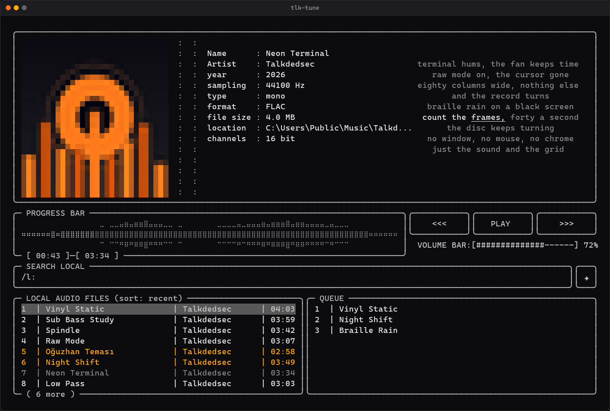
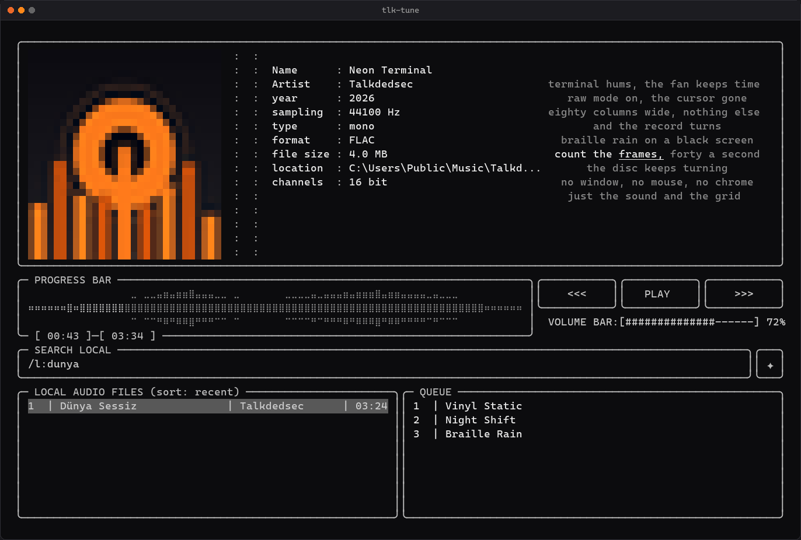
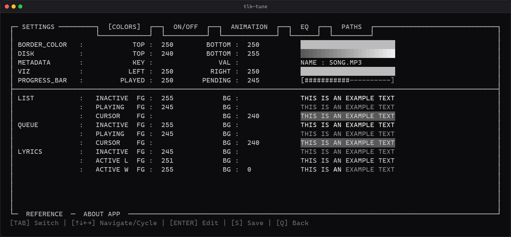
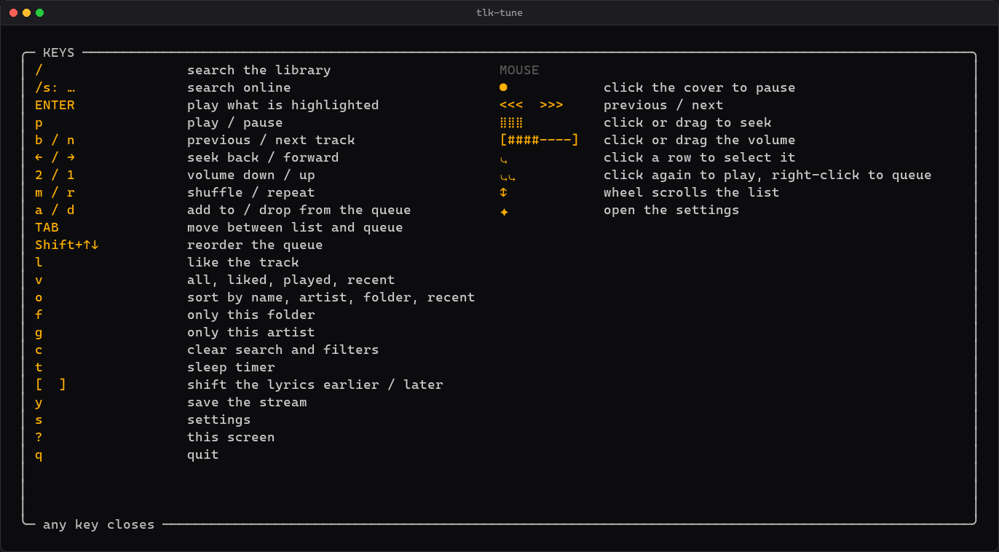
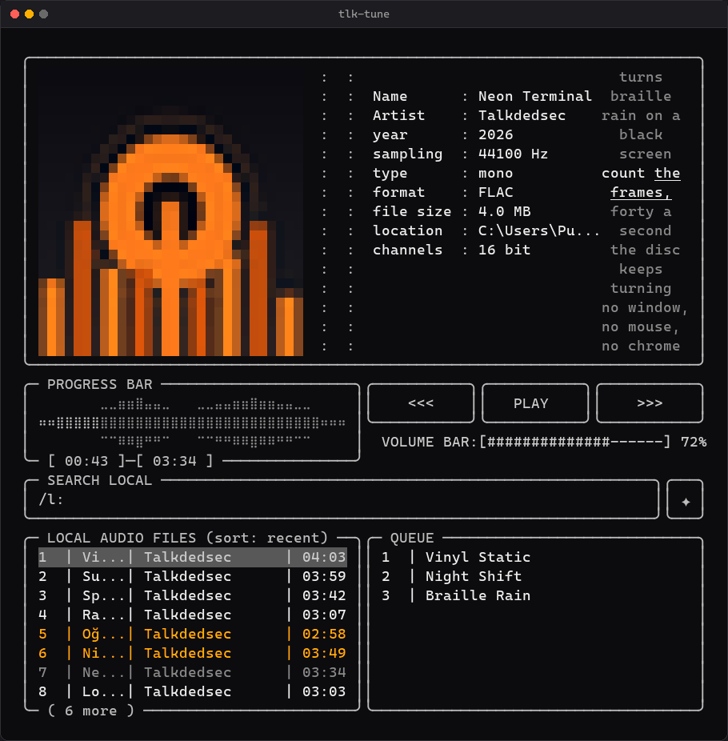

<div align="center">

# tlk-tune

### Everything a desktop music player does, in eighty columns.

Album art in colour. Lyrics that follow the word being sung. A ten-band
equaliser. Loudness levelling to broadcast standard.
**One 5.5 MB executable** — no ffmpeg, no codec pack, no runtime.

[](https://github.com/Talkdedsec/tlk-tune/actions/workflows/ci.yml)
[](https://github.com/Talkdedsec/tlk-tune/releases/latest)
[](LICENSE)
[](https://github.com/Talkdedsec/tlk-tune/releases/latest)

**[Download](https://github.com/Talkdedsec/tlk-tune/releases/latest)** ·
[Türkçe](README.tr.md) ·
[How it is built](docs/architecture.md)



</div>

## The part nobody expects

It is a text program you can use with the mouse.

**Click the record** to pause it. **Drag the waveform** to seek. **Click a row
once** to select it and **again** to play it, **right-click** to queue it.
**Roll the wheel** over the list. Every colour, every toggle, every slider on
the settings screen is clickable too — there is no configuration file to open
unless you want to.

The keyboard does all of it as well, and `?` puts both on screen.

<details>
<summary><b>Four more pictures</b></summary>

<br>

Search that ignores accents — `dunya`, typed on a keyboard with no Turkish on
it, finds `Dünya`:



Every colour edited against a live preview, no text editor involved:



Every key and every gesture, on `?`:



And it folds itself down when the window is narrow:



</details>

## Three minutes

1. Download `tlk-tune.exe` from the
   [latest release](https://github.com/Talkdedsec/tlk-tune/releases/latest).
2. Run it. With nothing configured it scans your Music and Downloads folders,
   so there is usually something to play straight away.
3. `?` shows every key and gesture. `s` opens the settings, where the PATHS
   tab is how you point it at the folder your music really lives in.

Nothing is written outside `%APPDATA%\tlk-tune` and `%LOCALAPPDATA%\tlk-tune`
until you ask for it, and `--install` is a separate, reversible step.

## What it does

### Sound

- Plays MP3, FLAC, WAV, OGG, Opus, M4A, AAC and AIFF, decoded natively in
  Rust. No ffmpeg, no codec pack, nothing to install alongside.
- **Gapless** track changes — the output device opens once and stays open —
  and an optional crossfade of up to twelve seconds.
- **Ten-band equaliser**, 31 Hz to 16 kHz at ±12 dB, with seven presets.
  Adjustable by arrow key or by dragging the slider. Flat is bypassed, not
  computed.
- **Loudness levelling** to EBU R 128. Each track is measured once and played
  at a consistent level ever after, with a soft limiter in place of clipping.
- Survives an unplugged headset: it reopens the device and keeps going.

### On screen

- **Album art** in colour where the record sits, from the cover embedded in
  the file or a `cover.jpg` beside it. In a terminal that speaks kitty's
  graphics protocol or sixel — Windows Terminal, kitty, WezTerm, Ghostty,
  foot, xterm — it is a real picture at real resolution rather than
  coloured blocks. A procedural spinning record is the fallback when there
  is no cover at all, not a placeholder box.
- **Synced lyrics** with the current word highlighted, from a sidecar `.lrc`
  or from LRCLIB, and shiftable per track when the published timings do not
  match your copy.
- Live FFT spectrum with configurable fluidity, decay and viscosity; a braille
  waveform of the whole track across the progress bar; a reactive sphere.
- Fits the window. The list shrinks on a short terminal and the record panel
  steps aside rather than letting the frame scroll off the top.
- **A settings screen with seven tabs** — colours, elements, animation, the
  equaliser, music folders, keys, about — all editable with the mouse against
  a live preview. No text editor needed.
- English and Turkish, switched without restarting.

### Your library

- Folders and `m3u`, `m3u8`, `pls` playlists are equally valid library roots.
- Titles come from the tags, so a folder of `001 - Artist - Title.mp3` reads
  as the titles rather than the filenames. Tag reads are cached by size and
  modification time, so a large library only pays for it once.
- **Search ignores accents**: `oguzhan` finds `Oğuzhan`, `dunya` finds
  `Dünya`. Typing Turkish on a keyboard that has none of it still works.
- Queue, shuffle, repeat, folder and artist filters, four sort orders.
- **Keep what you built**: `w` writes the queue, or whatever the list is
  showing after a search or a filter, as an `m3u8` beside your music. Paths
  go in relative, so the folder can be moved without the list breaking.
- **Likes, play counts and views**: `l` likes a track, `v` cycles the list
  between all, liked, most played and recently played. On a first run these
  import themselves from tlk-player if it happens to be installed.
- Remembers the track, the position, the volume and the queue between runs.

### Outside the window

- Mouse everywhere: the transport buttons, the waveform as a seek bar, the
  volume bar, rows, the queue, the wheel, every control in the settings.
- Media keys work while the terminal is in the background.
- A sleep timer, and a window title that says what is playing.
- Online search, streaming and downloads when `yt-dlp` is on PATH. Everything
  else works without it.
- `--install` puts it on your PATH under two names and adds a right-click
  entry for audio files, without administrator rights.

## Putting it on your PATH

The executable runs from wherever it sits, so this step is optional. When you
want `tlk-tune` to work in any terminal:

```
tlk-tune.exe --install
```

It copies itself to `%LOCALAPPDATA%\Programs\tlk-tune`, adds that folder to
your user PATH, drops a `tune.cmd` beside it so the short name works too, and
adds a "Play with tlk-tune" entry to the right-click menu of audio files. No
administrator rights, and `--uninstall` takes every part of it back out. Open
a new terminal afterwards and both names are there.

Optional: [yt-dlp](https://github.com/yt-dlp/yt-dlp) on PATH turns on online
search, streaming and downloads.

### Building it yourself

```
git clone https://github.com/Talkdedsec/tlk-tune.git
cd tlk-tune
cargo build --release
```

Rust 1.88 or newer. The binary lands at `target\release\tlk-tune.exe`. Every
release is built by CI from the tag and ships with a `SHA256SUMS` file, so a
download can be checked against it:

```
Get-FileHash tlk-tune.exe -Algorithm SHA256
```

## Keys

| Action | Key |
| :--- | :--- |
| Search local | `/` |
| Search online | `/` then `s: query` |
| Play / pause | `p` |
| Play selection | `Enter` |
| Next / previous | `n` / `b` |
| Seek | `←` / `→` |
| Volume | `2` / `1` |
| Shuffle / repeat | `m` / `r` |
| Queue add / remove | `a` / `d` |
| Switch panel | `Tab` |
| Filter by folder | `f` |
| Clear filter | `c` |
| Change sort | `o` |
| Like / unlike | `l` |
| Change view | `v` |
| Filter by artist | `g` |
| Reorder the queue | `Shift+↑` / `Shift+↓` |
| Shift the lyrics | `[` / `]` |
| Sleep timer | `t` |
| Save the list as a playlist | `w` |
| Every key, on screen | `?` |
| Download stream | `y` |
| Settings | `s` |
| Quit | `q` |

### Mouse

| Action | Gesture |
| :--- | :--- |
| Play / pause | Click the record, or the middle button |
| Previous / next | Click `<<<` / `>>>` |
| Seek | Click or drag the waveform |
| Volume | Click or drag the volume bar |
| Select a track | Click its row |
| Play a track | Click the row again |
| Queue a track | Right-click its row |
| Remove from queue | Right-click it in the queue |
| Scroll | Wheel over the list or the queue |
| Search | Click the search line |
| Settings | Click the ✦ box |
| In settings | Click a tab, click a value to cycle it, click twice to type |

Every binding is remappable on the settings screen's REFERENCE tab.

## Configuration

Written to `%APPDATA%\tlk-tune\config.txt` on exit, and re-read on start.
Colours are ANSI 256 palette indices as bare numbers; an empty value means
"leave it to the terminal".

```ini
Language=en
OutputDevice=

ColorBorderTop=250
ColorBorderBottom=250
ColorDiskTop=240
ColorDiskBottom=255

ElimentDisk=true
ElimentQueue=true
LyricsPlaceholderBall=false

VisualizerFluidity=10
LyricsAnimation=word by word
CrossfadeMs=0
Normalize=true
NormalizeTarget=-18.0
Equalizer=0.0,0.0,0.0,0.0,0.0,0.0,0.0,0.0,0.0,0.0

LocalMusicPath=D:\Music
LocalMusicPath=%USERPROFILE%\Music
LocalMusicPath=~/Music
LocalMusicPath=D:\Lists\night.m3u
```

An entry may be a folder or a playlist file, and `~`, `%VAR%` and `$VAR` are
expanded. With no `LocalMusicPath` set, the player scans your Music and
Downloads folders. The PATHS tab in the settings screen edits the same list
and shows whether each entry still resolves.

Tag reads are cached in `%LOCALAPPDATA%\tlk-tune\library.json`, keyed by size
and modification time, so only new or edited files are opened again on a later
start.

## Lyrics

A `.lrc` file next to the track wins. Enhanced LRC with `<mm:ss.xx>` word tags
drives the karaoke highlight directly. Otherwise the player asks LRCLIB and
spreads each line's timing over its words by character count, so the highlight
still moves word by word. Results are cached under
`%LOCALAPPDATA%\tlk-tune\lyrics`.

Published timings rarely match a rip of the same song, so `[` and `]` shift
them a quarter second at a time and the shift is remembered per track.

## Online

With `yt-dlp` on PATH, `/` then `s: query` searches. Playback streams over HTTP
range requests and starts on the first packet; a full download into
`%LOCALAPPDATA%\tlk-tune\stream` is the fallback for anything that refuses
range requests. `y` saves the selected result as mp3 into your first music
folder.

## Other flags

```
tlk-tune --install              put it on your PATH, both names
tlk-tune --uninstall            take it back off
tlk-tune <file>                 play that file, and add its folder
tlk-tune <words>                open with the library already searched
tlk-tune --preview 155          render one frame at width 155 and exit
tlk-tune --preview 155 oguzhan  render that frame with a search applied
tlk-tune --config <file> ...    keep the profile in that file instead
tlk-tune --version
```

`--preview` is how to check a colour scheme without launching the player. It
takes `--rows N` for a given window height and `--screen settings|help` for the
other two screens.

`--config` moves the whole profile — settings, session and statistics live in
one folder — so the player can run from a stick without touching the machine
it is plugged into. It has to come first on the line.

## Terminal

Needs a terminal that draws braille and box-drawing glyphs. Windows Terminal
works out of the box; classic `conhost` needs a font like Cascadia Mono or
DejaVu Sans Mono. The player switches the console to UTF-8 itself.

## When something is wrong

| What you see | What it is |
| :--- | :--- |
| Boxes or question marks instead of the record | The font has no braille. Cascadia Mono and DejaVu Sans Mono do. |
| `tlk-tune` not found after `--install` | The PATH change reaches new terminals only. Open a fresh one. |
| No sound, everything else fine | Another program holds the device exclusively, or the default changed. The Output Device row on the settings screen's ANIMATION tab cycles through what is actually there. |
| Media keys do nothing | Another player claimed them first. Whoever registers first keeps them until it exits. |
| Lyrics never arrive | There is no `.lrc` beside the track and LRCLIB has nothing for it. Tags that name the real title and artist help. |
| Online search says nothing found | `yt-dlp` is not on PATH. Everything local works without it. |
| The frame scrolls or tears | The window is shorter than the layout. It sheds panels as it narrows, but it needs about twelve rows. |

## Reading the code

[docs/architecture.md](docs/architecture.md) is the map: what each module does,
which thread it runs on, and the handful of rules that are silent when broken.

## License

MIT. See [LICENSE](LICENSE).
